# Workflow Architecture

> Updated on 2025-07-21 by @KemingHe

Modular automation for weekly Python dependency manager documentation updates.

## 🏗️ Current System

```mermaid
graph LR
    CRON_TRIGGER["⏰ Tuesday 6pm ET<br/>Cron Trigger"]
    ORCHESTRATOR["🎯 Orchestrator<br/>auto-update.yml"]
    UPDATE_DOCS["📚 Documentation Sync<br/>auto-update-docs.yml"]
    UPDATE_INDEX["🔍 Search Index<br/>auto-update-index.yml"]
    PUBLISH["🐳 Publish Image<br/>auto-update-publish.yml"]

    CRON_TRIGGER --> ORCHESTRATOR
    ORCHESTRATOR --> UPDATE_DOCS
    UPDATE_DOCS --> UPDATE_INDEX
    UPDATE_INDEX --> PUBLISH
```

**Security**: Pinned 3rd-party actions, signed commits, modular execution, [CodeQL analysis](README-codeql.md)

## 🚀 Planned Extensions

- **Managers**: pipenv, pdm, pixi
- **Features**: Conditional updates, performance monitoring

## 🔧 Operations

- **Testing**: `workflow_dispatch` on `update-docs`, `update-index`, and `publish`
- **Monitoring**: Check Tuesday runs for upstream changes
