# Workflow Architecture

> Updated on 2025-07-15 by @KemingHe

Modular automation for weekly Python dependency manager documentation updates.

## 🏗️ Current System

```mermaid
graph TD
    CRON_TRIGGER["⏰ Tuesday 6pm ET<br/>Cron Trigger"]
    ORCHESTRATOR["🎯 Orchestrator<br/>auto-update.yml"]
    UPDATE_DOCS["📚 Documentation Sync<br/>auto-update-docs.yml"]

    CRON_TRIGGER --> ORCHESTRATOR
    ORCHESTRATOR --> UPDATE_DOCS
```

**Security**: Pinned action hashes, signed commits, sequential execution

## 🚀 Planned Extensions

- **Workflows**: `auto-update-index.yml` (Tantivy), `auto-build-and-deploy.yml` (Docker)
- **Managers**: pipenv, pdm, pixi
- **Features**: Conditional updates, performance monitoring

## 🔧 Operations

- **Testing**: `workflow_dispatch` on both workflows  
- **Monitoring**: Check Tuesday runs for upstream changes
