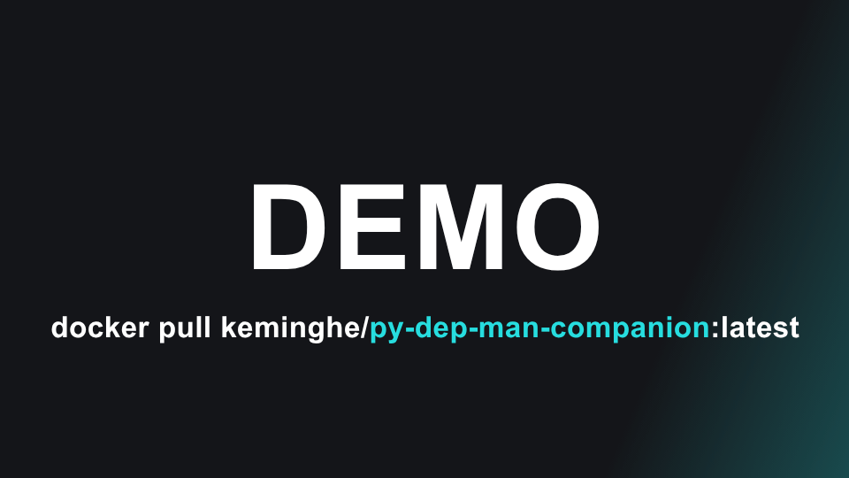

# Python Dependency Manager Companion MCP Server

> README updated on 2025-07-23 by [@KemingHe](https://github.com/KemingHe)

Stop getting out-of-date Python package manager commands from your AI. Cross-reference latest official `pip`, `poetry`, `uv`, and `conda` docs with auto-updates.

**Click to play demo**:

[](./docs/assets/2025-07-27-demo.mp4)

## 🚀 Quick Start for Agentic IDEs

**1. Pull Docker image**:

```shell
# Pin to commit hash for production security
# Get current hash from: https://hub.docker.com/r/keminghe/py-dep-man-companion/tags
docker pull keminghe/py-dep-man-companion@sha256:2c896dc617e8cd3b1a1956580322b0f0c80d5b6dfd09743d90859d2ef2b71ec6  # 2025-07-22 release example

# Or use latest for development
docker pull keminghe/py-dep-man-companion:latest
```

**2. Add to your IDE's `mcp.json`**:

```json
{
  "mcp": {
    "servers": {
      "python-deps": {
        "command": "docker",
        "args": ["run", "-i", "--rm", "keminghe/py-dep-man-companion"]
      }
    }
  }
}
```

**3. Ask package manager questions** - "How to migrate a `conda` project to `uv`?" and get accurate, current official syntax.

## 🤝 Contributing

**Use as template**: [[Create from template]](https://github.com/new?template_name=python-dependency-manager-companion-mcp-server&template_owner=KemingHe) for your own MCP server projects.

**Contribute back**: Fork and follow [CONTRIBUTING.md](./CONTRIBUTING.md) for development setup.

## 🔄 Auto-Update Architecture

1. ⏰ **Every Tuesday 6pm ET**
2. 📚 **Sync Official Docs**
3. 🔍 **Rebuild Search Index**
4. 🐳 **Publish Latest Image**

## 🗺️ Roadmap

- [ ] Add support for `pipenv`, `pdm`, `pixi`
- [ ] Add comprehensive tests with 100% coverage  
- [ ] Add indexing support for PDF and CSV files

## 📁 Project Structure

```plaintext
python-dependency-manager-companion-mcp-server/
├── .github/workflows/            # Automation workflows
│   ├── auto-update-docs.yml      # Weekly docs update
│   ├── auto-update-index.yml     # Search index rebuild
│   ├── auto-update-publish.yml   # Multi-arch Docker publish
│   ├── auto-update.yml           # Combined automation
│   └── README.md                 # Workflow documentation
├── src/
│   ├── assets/               # Documentation source files
│   │   ├── conda/            # conda docs  
│   │   ├── pip/              # pip docs
│   │   ├── poetry/           # poetry docs
│   │   └── uv/               # uv docs
│   ├── index/                # Pre-built search index
│   ├── build_index.py        # Tantivy index builder
│   └── mcp_server.py         # FastMCP stdio server
├── Dockerfile                # Container build configuration
├── pyproject.toml            # Project dependencies and metadata
└── uv.lock                   # Locked dependencies
```

## 📄 License

This project is licensed under the [MIT License](./LICENSE) - a permissive license that allows free use, modification, and distribution with attribution.

## 📞 Support

Open a [GitHub issue](https://github.com/KemingHe/python-dependency-manager-companion-mcp-server/issues) for bug reports and feature requests.
